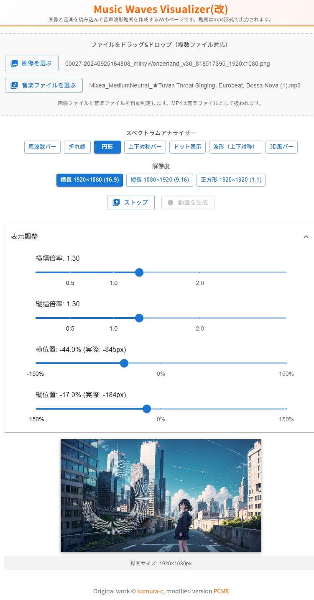

# Music Waves Visualizer(改)

画像と音楽ファイルを読み込んで、音声波形を可視化した動画を作成するWebアプリケーションです。

## デモ

https://lil.la/visualizer/

### Music Waves Visualizer(改) 実行イメージ

<a href="./Image.jpg" target="_blank">
  
</a>

*画像をクリックすると原寸大で表示されます*

## 主な機能

- **ファイル読み込み**: ドラッグ&ドロップまたはボタンから画像・音楽ファイルを読み込み
- **画像の自動スケーリング**: 読み込んだ画像を推奨解像度（1920×1080等）に自動拡大・縮小（アスペクト比維持、隙間なしで最大表示）
- **7つのスペクトラムアナライザーモード**: 様々な波形表示スタイルを選択可能
- **3つの解像度**: 1920×1080、1080×1920、1920×1920から選択
- **表示調整機能**: 各モードごとに倍率・位置を調整可能
- **プレビュー機能**: 音楽を再生しながら波形をリアルタイム表示
- **動画生成**: MP4形式で動画を出力
- **クリア**: 画像・音楽の選択解除や設定を初期状態に戻す

## クイックスタート

### ローカル開発

```bash
npm install
npm run dev
```

ブラウザで http://localhost:3000 にアクセス

### Docker

```bash
# 本番モード
docker-compose up --build

# 開発モード
docker-compose -f docker-compose.dev.yml up --build

# 他PCからHTTPSでアクセス（FFmpeg動画変換対応）
./generate-ssl-cert.sh <サーバーIP>
docker compose -f docker-compose.https.yml up -d --build
```

詳細は [README_DOCKER.md](./README_DOCKER.md) を参照

### レンタルサーバー用静的配布

```bash
npm run build:html
```

`html/` ディレクトリをサーバーの `visualizer` フォルダにアップロードし、`https://あなたのドメイン/visualizer/` でアクセス可能

## 使用方法

1. **ファイルの読み込み**: ドラッグ&ドロップまたはボタンから画像・音楽ファイルを選択
2. **スペクトラムアナライザーを選択**: 7つのモードから選択
3. **解像度を選択**: 3つの解像度から選択
4. **表示調整（オプション）**: 倍率や位置を調整
5. **プレビュー**: 音楽を再生しながら波形を確認
6. **動画を生成**: MP4形式で動画を出力（生成中はウィンドウを切り替えないでください）
7. **クリア**: 初期状態に戻す

詳細は [仕様書.md](./仕様書.md) を参照

## ドキュメント

- **[仕様書.md](./仕様書.md)**: 技術仕様と機能詳細
- **[README_DOCKER.md](./README_DOCKER.md)**: Dockerの使い方
- **[サーバー要件.md](./サーバー要件.md)**: レンタルサーバー・共有ホスティング用の要件
- **[サーバー要件(local docker)用.md](./サーバー要件(local%20docker)用.md)**: ローカル・Docker環境用の詳細要件
- **[DEVELOPER_MODE.md](./DEVELOPER_MODE.md)**: 開発者モードの説明
- **[CHANGELOG.md](./CHANGELOG.md)**: 変更履歴

## クレジット

このプロジェクトは [komura-c/music-waves-visualizer](https://github.com/komura-c/music-waves-visualizer) をベースにしています。

元記事: [オーディオ波形動画を生成するWebぺージの作り方](https://tech-blog.voicy.jp/entry/2022/12/11/235929)

## ライセンス

元のリポジトリのライセンス情報を参照してください。

Original work © komura-c, modified version [KURAGASHI](https://github.com/kuwa2005/music-waves-visualizer)
