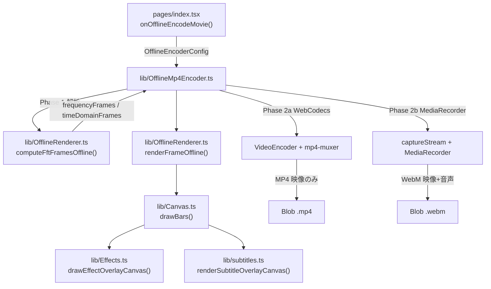

# 問題点レポート（2026-06-30）

オフラインエンコード実装の俯瞰レビュー。報告症状（数秒動いて停止→再開、エフェクト・字幕が更新されない、スペアナが全く表示されない）を軸に整理した。

---

## 1. アーキテクチャ概要



| フェーズ | 処理 | 備考 |
|---------|------|------|
| Phase 1 | クリップ切り出し・フェード後の AudioBuffer から 60fps 固定で FFT / タイムドメインを事前計算 | ライブ `AnalyserNode` は使わない |
| Phase 2a | オフスクリーン Canvas にフレーム描画 → WebCodecs → MP4 | **音声トラックなし** |
| Phase 2b | 同上 → `captureStream` + MediaRecorder → WebM | 音声は `BufferSource` でリアルタイム再生 |

---

## 2. 報告症状との対応（優先度順）

### P0: スペアナ透過率の式がプレビューと逆

**症状**: スペアナが全く表示されない / 極端に薄い

| 経路 | コード | スライダー 0%（UI上「完全表示」） | スライダー 10%（デフォルト） |
|------|--------|-----------------------------------|------------------------------|
| プレビュー | `pages/index.tsx` L3467 `1 - spectrumOpacityPercent / 100` | opacity = 1.0 → 表示 | opacity = 0.9 → ほぼ不透明 |
| オフライン | `pages/index.tsx` L5354 `spectrumOpacityPercent / 100` | opacity = 0 → **`getVisualOpacity(0) === 0` で完全不可視** | opacity = 0.1 → かなり薄い |

UI コメント（L930）: `透過率0-100%、0=完全表示` — オフライン側だけ意味が逆。

`getVisualOpacity()`（`lib/Canvas.ts` L237–241）は opacity=0 で 0 を返すため、**透過率 0% 設定ではスペアナが完全に消える**。

---

### P0: モード 1 / 5 の間引き状態がオフライン開始時にリセットされない

**症状**: 折れ線（mode 1）・対称波形（mode 5）でスペアナが常に非表示

`drawBars` 内（`lib/Canvas.ts` L1115–1134）:

```typescript
const now = performance.now();  // オフライン中は syntheticTimeSec * 1000 に差し替え
if (mode === 1) {
  const last = (drawBars as any)._lastTimeMode1 ?? 0;
  if (now - last < interval) skipSpectrumDraw = true;
}
```

- オフライン中 `performance.now()` は合成時刻（0, 16.67, 33.33 … ms）にスタブされる
- `_lastTimeMode1` / `_lastTimeMode5` はプレビュー時の**壁時計 ms**（例: 5,000,000）のまま残る
- `initOfflineRenderer()` → `resetDrawBarsState()`（`lib/OfflineRenderer.ts` L75–93）は **これらをリセットしない**
- 結果: `now - last` が常に負 → `skipSpectrumDraw = true` が全フレーム継続 → **スペアナ本体が一切描画されない**

エフェクト・字幕は `skipSpectrumDraw` の外側（L2234 以降）で描画されるため、背景＋エフェクト＋字幕だけ見える状態になりうる。

---

### P0: WebCodecs 経路に音声が含まれない

**症状**: MP4 出力が無音（映像停止とは別問題だが、オフライン出力品質に直結）

- `encodeWithWebCodecs()` は `audioBuffer` / `audioContext` を受け取るが **Mux していない**（`lib/OfflineMp4Encoder.ts` L272–281）
- UI は `format === "mp4"` で「MP4生成完了」と通知（L5418）
- 通常録画は WebM → FFmpeg → MP4 + 音声あり。オフライン WebCodecs だけ機能差がある

---

### P1: Effects.ts のモジュール級時刻状態がリセットされない

**症状**: エフェクトが数秒止まる / 更新されない / 初帧で静止

`lib/Effects.ts` L313–316:

```typescript
let lastTime = performance.now();
let lastOverlayDrawTime = performance.now();
```

- `initOfflineRenderer()` は `drawBars` 内部状態のみリセット。Effects 側は未対応
- プレビュー後にオフライン開始すると `lastOverlayDrawTime` が壁時計 ms のまま
- `drawEffectOverlayCanvas`（L2395–2397）: `overlayDelta = max(nowOverlay - lastOverlayDrawTime, 0)` → **初帧 delta = 0** → rain / dust / snow 等が進まない
- `drawSpaceEffectCanvas`（L335–337）: 下限クランプなし → 初帧で **負の deltaTime** が粒子更新に入る

合成時刻が 16.67ms 刻みで進むと、2帧目以降は delta ≈ 16.67ms で正常化する。ただしプレビュー稼働時間が長いほど初帧異常が目立つ。

**周期性の停止**（数秒動いて止まる）については、以下も合わせて疑う:

| 要因 | 説明 |
|------|------|
| MediaRecorder 50ms wait 上限 | `renderFramesAsync` L494–495: 1フレーム待機が最大 50ms。レンダリング遅延時にペーシング不足 → 映像フレーム欠落 |
| `captureStream` と `requestFrame` 未使用 | MR 経路で `canvas.captureStream(frameRate)` のみ。Chromium では明示 `requestFrame()` なしだと更新取りこぼしの報告あり |
| オフスクリーン Canvas `desynchronized: true` | `OfflineMp4Encoder.ts` L169–172。描画完了前に `VideoFrame` 取得 → 空白・静止フレームが混ざる可能性 |

---

### P1: 字幕のクリップ開始オフセット未反映

**症状**: クリップ範囲指定時、字幕タイミングがずれる / 表示されない区間がある

- 音声は `clipStartSec` で切り出し、フレーム時刻は **0 起点**（`currentFrameTimeSec = frameIdx * frameDuration`）
- 字幕 cues は SRT 原本の絶対時刻のままスナップショット（`pages/index.tsx` L5371–5376）
- クリップ途中からエンコードすると、字幕の `startSec` / `endSec` と映像時刻が不一致

`getCurrentTimeSec` のパッチ自体（`OfflineMp4Encoder.ts` L532–537）は正しく動作する。オフセット設計の問題。

---

### P1: タイトルオーバーレイが静止

- オフライン設定で `isPlaying: false` 固定（`pages/index.tsx` L5382）
- 冒頭アニメーション中のタイトルはプレビューと見た目が一致しない

---

## 3. その他の懸念点

### 3.1 `isOfflineEncodeSupported()` の命名と分岐

```typescript
// lib/OfflineMp4Encoder.ts L631–632
export function isOfflineEncodeSupported(): boolean {
  return typeof document !== "undefined" && typeof MediaRecorder !== "undefined";
}
```

- 名前は「オフライン対応」だが、実際は **WebCodecs 経路を選ぶか** の判定に使われている
- MediaRecorder があれば常に WebCodecs を先に試行 → 多くの環境で **無音 MP4** がデフォルト出力

### 3.2 プレビューとオフラインの機能差

| 機能 | プレビュー / 通常録画 | オフライン |
|------|----------------------|-----------|
| レンダラー | Canvas 2D / WebGL | Canvas 2D のみ |
| 動画背景 | あり | 非対応（静止画のみ） |
| 透過率スライダー | `1 - p/100` | `p/100`（**逆**） |
| ギャラリー自動切替 | あり | 現在表示中 1 枚のみ |
| 出力 | WebM → FFmpeg → MP4 | WebCodecs: MP4 無音 / MR: WebM |
| サムネイル FFmpeg | あり | なし |

### 3.3 dead code / 設定未配線

- `OfflineEncoderConfig.subtitleOverlay` / `titleOverlay` は型定義あるが UI から未使用。実際は `spectrumSettings` 内のみ
- `renderFrameOfflineFull()` の `subtitleOverlay` / `titleOverlay` 引数は未使用（L175–176, L544）
- `frameDurationSec: 1 / 60` ハードコード（`OfflineMp4Encoder.ts` L542）。現状 UI も 60 固定だが `config.frameRate` と非連動

### 3.4 FFT 正規化とライブ Analyser の差

- オフライン FFT は自前 Cooley-Tukey + Hamming 窓（`OfflineRenderer.ts`）
- Web Audio `AnalyserNode` とはスケールが完全一致しない。弱い信号ではバーが低く見える可能性

### 3.5 デバッグログ

- `[offline-debug]` 等の `console.log` が `OfflineMp4Encoder.ts` / `OfflineRenderer.ts` に残存。本番コンソール汚染・わずかな性能影響の可能性

### 3.6 QuickVideoEncoder（参考）

- UI 非表示だがコード残存。簡易スペクトラムのみ。エフェクト・字幕・全モード非対応。オフライン本流とは別経路

### 3.7 テストカバレッジ

- `lib/__tests__/offlineMp4Encoder.test.ts`: キャンセル / cleanup のみ
- 実エンコード、スペアナ表示、字幕同期、エフェクト更新の結合テストなし

---

## 4. 症状別 原因マトリクス

| 報告症状 | 最有力原因 | 該当コード |
|---------|-----------|-----------|
| スペアナ全く表示されない | 透過率式の逆転（0%=不可視） | `pages/index.tsx` L3467 vs L5354 |
| スペアナ全く表示されない（mode 1/5） | `_lastTimeMode1/5` 未リセット → 常時 skip | `lib/Canvas.ts` L1115–1134, `OfflineRenderer.ts` L75–93 |
| 数秒動いて停止→再開 | MR ペーシング不足 / captureStream 取りこぼし / desynchronized 描画 | `OfflineMp4Encoder.ts` L169–172, L388–389, L494–495 |
| エフェクトが更新されない | Effects モジュール `lastTime` 未リセット、初帧 delta=0 | `lib/Effects.ts` L313–316, L2395–2397 |
| 字幕が更新されない | クリップオフセット未反映（cues 時刻とフレーム時刻の不一致） | `pages/index.tsx` L5348–5376 |
| MP4 なのに無音 | WebCodecs 経路に AudioEncoder なし | `OfflineMp4Encoder.ts` L272–281 |

---

## 5. 修正方針（参考）

優先度順:

1. **透過率**: オフラインも `opacity: 1 - spectrumOpacityPercent / 100` に統一
2. **mode 1/5 間引き**: `resetDrawBarsState()` に `_lastTimeMode1` / `_lastTimeMode5` 追加、またはオフライン時は間引きバイパス
3. **Effects 状態**: `initOfflineRenderer()` から `Effects.ts` の `lastTime` / `lastOverlayDrawTime` 等をリセットする API を追加
4. **WebCodecs 音声**: `AudioEncoder` + muxer audio track、または WebCodecs 後 FFmpeg mux
5. **字幕クリップ**: `getCurrentTimeSec` に `clipStartSec` 加算、または cues をクリップ起点にシフト
6. **MediaRecorder 同期**: wait 50ms cap 見直し、`requestVideoFrameCallback` / `requestFrame()` 追加
7. **Canvas コンテキスト**: オフライン描画時 `desynchronized: false` を検討

---

## 6. 主要ファイル索引

| ファイル | 役割 |
|---------|------|
| `pages/index.tsx` | UI 入口、`OfflineEncoderConfig` 組み立て |
| `lib/OfflineMp4Encoder.ts` | エンコード本体（WebCodecs / MediaRecorder） |
| `lib/OfflineRenderer.ts` | FFT 事前計算、フレーム描画、`performance.now` スタブ |
| `lib/Canvas.ts` | スペアナ全モード、`drawBars`、エフェクト/字幕合成 |
| `lib/Effects.ts` | エフェクトオーバーレイ（モジュール級時刻状態） |
| `lib/subtitles.ts` | 字幕描画、`getCurrentTimeSec` によるキュー選択 |
